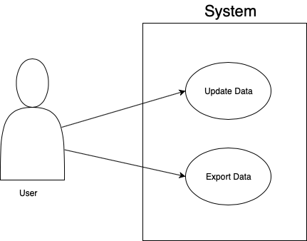

README.md

University of Dayton

Department of Computer Science

CPS 491 - Capstone II, Spring 2019

Instructor: Dr. Phu Phung

Capstone II Project

MB Investing

Andrew Case
casea4@udayton.edu

Project Management Information
Management board (private access): https://trello.com/b/HecP4clF/cps491-casea4

Source code repository (private access): https://bitbucket.org/andrewcasedayton/cps491-casea4/src/master/

###use case overview

Revision History
Date	Version	Description
9/5/2019	0.0	Init draft

Overview

MB Investing originally started as a manual process. There were numerous forms that the members of the club had to fill out that were not understood by many within the club. 
Some of these forms included linking bank accounts to Fidelity, filing for a partnership, and signing contracts regarding the rules of our partnership. 
Therefore, education was a big part of our organization from the start. I’d say that is the primary purpose of the investment club is educating those members who have little knowledge of
 financial markets as well as making the process of being an investor smooth and easy. This education has paid off as well because our club even with rocky markets in the 
 past year has managed to beat the S&P 500. This is a good indicator for our relatively new club, and I’m hoping that this information system has the potential to help our performance
  even more in the future.
	It is important to outline some of the business logic for our club as well as some of the issues we’ve run into. The first of these is to have a way for members to 
    easily make payments into the site. This process currently occurs by members having linked bank accounts to a central Fidelity account. 
    However, the paperwork didn’t go through for several members so they have to Venmo (online way of payment similar to PayPal) a different member who then places their money 
    into Fidelity. This is not an efficient way for funds to enter the account.
	It is also necessary to have a way for members to track and analyze key stocks. The president of MB Investing has done considerable research into the financial 
    markets and identified several key ways that we can make predictions and analysis on the market. These methods will continue to evolve, but so far he has made these
     predictions using Fidelity’s stock screener tools and excel. The following is an excerpt explaining some of these steps and some stocks that were picked as a result.
“ I would also like to explain some of the steps, in case anyone would like to perform similar steps on their own or would just like to understand how I arrived
 at my decisions. First, I performed a basic stock screen on Fidelity, using no preset criteria. Instead, I filtered by requiring the stocks to have a PEG ratio 
 of less than 5 (in general the lower the PEG, the better), an Equity Score of at least Bullish (Bullish and Very Bullish are the best – this means that a majority of 
 analysts feel that the stock has a positive future growth), and a market cap of at least one billion (this filtered out small, more volatile companies that are harder 
 for non-professionals to analyze). From this list, I looked for companies that had good results from their S&P Capital IQ Fundamentals, a strong PEG ratio, and other factors. 
 This included looking at their respective industry, as I examined our portfolio on Fidelity and discovered we were particularly underrepresented in Industrials, Materials, and IT. 
 These results are in “Screener 2.5.19” and yielded the following possibilities: Transmission Holdings (ALSN), Delta Airlines (DAL), Cigna Corp (CI), Citigroup (C), Verizon (VZ),
  Bank of America (BAC), and Microsoft (MSFT).”
This needs to be changed because these excel sheets are tedious to maintain and update. The functionality for how we will achieve further financial analysis is explained in Main Functions.

Project Context and Scope
Describe the context where the project will be used or deployed and the scope of the project your team will develop Note: For sprint 0, you can copy the content from your project proposal in CPS 490. You need to update this section according to in each sprint

System Analysis
(Start from Sprint 0, keep updating)

High-level Requirements
List high-level requirements of the project that your team will develop into use cases in later steps

Use cases
Draw the overview use case diagram, and define use case description (Main focus of Sprint 0)

System Design
(Start from Sprint 1, keep updating)

Use-Case Realization
Database
User Interface
Implementation
(Start from Sprint 1, keep updating. However, it is important to prepare the technology from Sprint 0)

For each new sprint cycle, update the implementation of your system (break it down into subsections). It is helpful if you can include some code snippets to illustrate the implementation

Specify the development approach of your team, including programming languages, database, development, testing, and deployment environments.

Deployment
Describe how to deploy your system in a specific platform.

Software Process Management
(Start from Sprint 0, keep updating)

Introduce how your team uses a software management process, e.g., Scrum, how your teamwork, collaborate.

Include the Trello board with product backlog and sprint cycles in an overview figure and also in detail description. (Main focus of Sprint 0)

Also, include the Gantt chart reflects the timeline from the Trello board. (Main focus of Sprint 0)

Scrum process
Sprint 0
Duration: 1/15/2019-1/28/2019

Completed Tasks:
Task 1
Task 2
...
Contributions:
Member 1, x hours, contributed in xxx
Member 2, x hours, contributed in xxx
Member 3, x hours, contributed in xxx
Member 4, x hours, contributed in xxx
Sprint 1
Duration: 1/29/2019-2/13/2019

Completed Tasks:
Task 1
Task 2
...
Contributions:
Member 1, x hours, contributed in xxx
Member 2, x hours, contributed in xxx
Member 3, x hours, contributed in xxx
Member 4, x hours, contributed in xxx
Sprint Retrospection:
_(Introduction to Sprint Retrospection:

Working through the sprints is a continuous improvement process. Discussing the sprint has just completed can improve the next sprints walk through a much efficient one. Sprint retrospection is done once a sprint is finished and the team is ready to start another sprint planning meeting. This discussion can take up to 1 hour depending on the ideal team size of 6 members. Discussing good things happened during the sprint can improve the team's morale, good team-collaboration, appreciating someone who did a fantastic job to solve a blocker issue, work well-organized, helping someone in need. This is to improve the team's confidence and keep them motivated. As a team, we can discuss what has gone wrong during the sprint and come-up with improvement points for the next sprints. Few points can be like, need to manage time well, need to prioritize the tasks properly and finish a task in time, incorrect design lead to multiple reviews and that wasted time during the sprint, team meetings were too long which consumed most of the effective work hours. We can mention every problem is in the sprint which is hindering the progress. Finally, this meeting should improve your next sprint drastically and understand the team dynamics well. Mention the bullet points and discuss how to solve it.)

Good	Could have been better	How to improve?
Sprint ...
Duration: MM/DD/YYYY-MM/DD/YYYY

Completed Tasks:
Task 1
Task 2
...
Contributions:
Member 1, x hours, contributed in xxx
Member 2, x hours, contributed in xxx
Member 3, x hours, contributed in xxx
Member 4, x hours, contributed in xxx
Sprint Retrospection:
Good	Could have been better	How to improve?