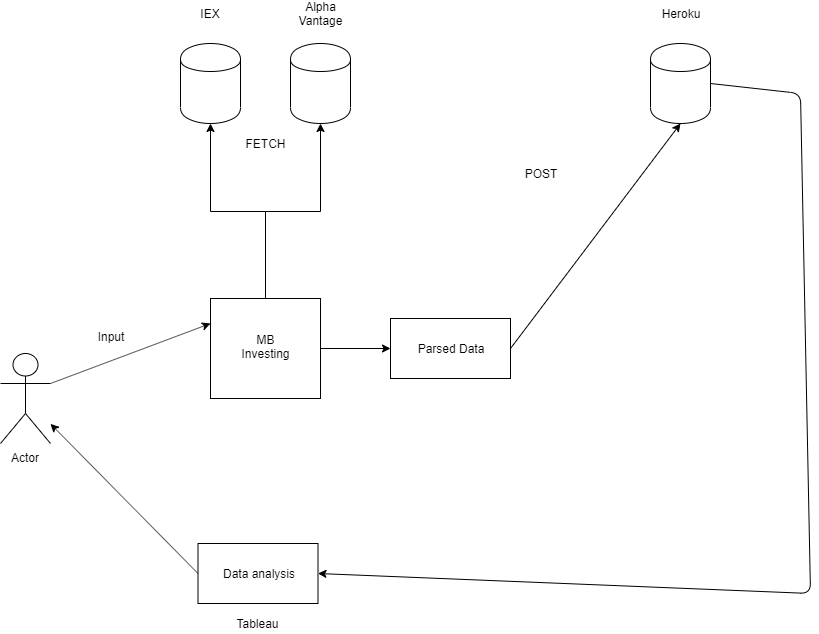
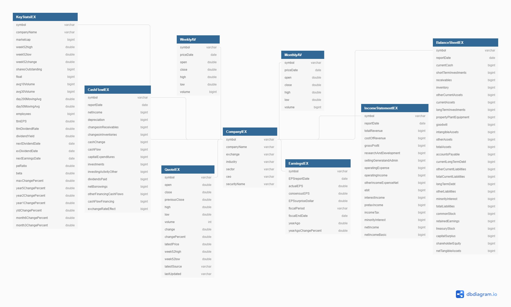
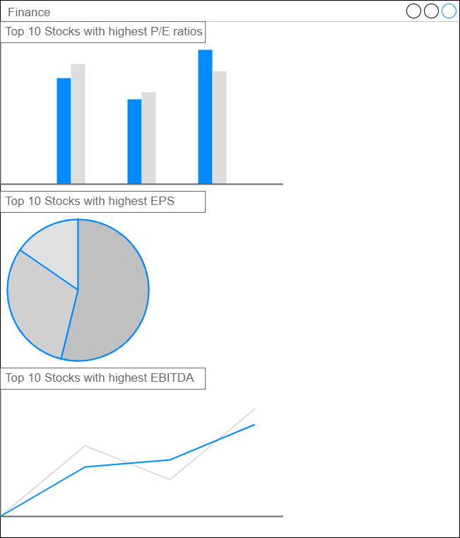
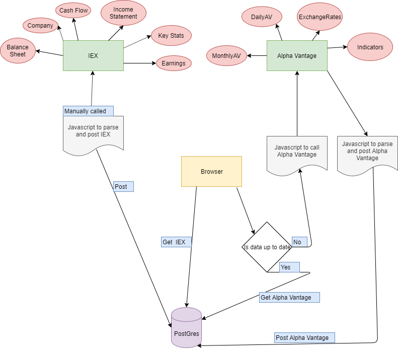

README.md

University of Dayton

Department of Computer Science

CPS 491 - Capstone II, Spring 2019

Instructor: Dr. Phu Phung

Capstone II Project

MB Investing

Andrew Case
casea4@udayton.edu

Project Management Information
Management board (private access): https://trello.com/b/HecP4clF/cps491-casea4

Source code repository (private access): https://bitbucket.org/andrewcasedayton/cps491-casea4/src/master/

### Overview

MB Investing originally started as a manual process. There were numerous forms that the members of the club had to fill out that were not understood by many within the club. 
Some of these forms included linking bank accounts to Fidelity, filing for a partnership, and signing contracts regarding the rules of our partnership. 
Therefore, education was a big part of our organization from the start. I’d say that is the primary purpose of the investment club is educating those members who have little knowledge of
 financial markets as well as making the process of being an investor smooth and easy. This education has paid off as well because our club even with rocky markets in the 
 past year has managed to beat the S&P 500. This is a good indicator for our relatively new club, and I’m hoping that this information system has the potential to help our performance
  even more in the future.
	It is important to outline some of the business logic for our club as well as some of the issues we’ve run into. The first of these is to have a way for members to 
    easily make payments into the site. This process currently occurs by members having linked bank accounts to a central Fidelity account. 
    However, the paperwork didn’t go through for several members so they have to Venmo (online way of payment similar to PayPal) a different member who then places their money 
    into Fidelity. This is not an efficient way for funds to enter the account.
	It is also necessary to have a way for members to track and analyze key stocks. The president of MB Investing has done considerable research into the financial 
    markets and identified several key ways that we can make predictions and analysis on the market. These methods will continue to evolve, but so far he has made these
     predictions using Fidelity’s stock screener tools and excel. The following is an excerpt explaining some of these steps and some stocks that were picked as a result.
“ I would also like to explain some of the steps, in case anyone would like to perform similar steps on their own or would just like to understand how I arrived
 at my decisions. First, I performed a basic stock screen on Fidelity, using no preset criteria. Instead, I filtered by requiring the stocks to have a PEG ratio 
 of less than 5 (in general the lower the PEG, the better), an Equity Score of at least Bullish (Bullish and Very Bullish are the best – this means that a majority of 
 analysts feel that the stock has a positive future growth), and a market cap of at least one billion (this filtered out small, more volatile companies that are harder 
 for non-professionals to analyze). From this list, I looked for companies that had good results from their S&P Capital IQ Fundamentals, a strong PEG ratio, and other factors. 
 This included looking at their respective industry, as I examined our portfolio on Fidelity and discovered we were particularly underrepresented in Industrials, Materials, and IT. 
 These results are in “Screener 2.5.19” and yielded the following possibilities: Transmission Holdings (ALSN), Delta Airlines (DAL), Cigna Corp (CI), Citigroup (C), Verizon (VZ),
  Bank of America (BAC), and Microsoft (MSFT).”
This needs to be changed because these excel sheets are tedious to maintain and update. The functionality for how we will achieve further financial analysis is explained in Main Functions.

### Project Context and Scope

For this semester, the project scope is to create server-side logic to parse data pulled from two third party locations, IEX and Alpha Vantage. These two sites hold reliable financial information for a number of different stocks. The data that will be analyzed is a stocks company information, their historical and current stock prices, earnings, balance sheet, cash flow, income statement, and several key statistical measures. A full accounting of this information will be provided in later sections. This information was chosen because it represents a wide array of information about any chosen stock. This information can be used to derive key financial ratios that will be used to make financial decisions for the investment club.

### High-level Requirements

At the highest level, api calls will be made to fetch the data at regular intervals. This data will be parsed and then stored into a heroku database. After this, it will be displayed in tableau where the members of the club will do financial analysis. Based on this analysis, graphs will be created to show users about a particular stocks performance. For example, one of these graphs could contain the top 10 stocks with high performing asset ratios. 

### Use cases

### System Design

### Database

This database diagram shows the focus of the project. All the data centers around the company table. This is because all the information shown relates to financial information about stocks. The information all ties in to the company table which has sector and industry tags to show a high level overview of markets, and it can be broken down further to show information about specific stocks.

### User Interface

This user interface shows what I hope to accomplish by the end of this semester. I hope to use the information we gather from IEX and Alpha Vantage to display meaningful graphs that show financial trends in the market. Some of these graphs could look like the ones shown below.

### Implementation

The implementation of MB Investing involves making a node.js route in order to call two different third party servers, IEX and Alpha Vantage. These servers give detailed financial information about different stocks as well as performance indicators for them as well. The flow of this data through the site is shown in the diagram below.

### System Design:

express.js front end
postgresql server on back end
Postman is used for testing API calls

### Languages:

JavaScript
PostgreSQL

### Deployment

My system is deployed to heroku. In order to deploy the system I used the Heroku CLI tool to push my repository to the hosting site. In the future, a pipeline will be implemented from bitbucket to heroku so code is pushed together. The current approach is two independent pushes to bitbucket and heroku.

